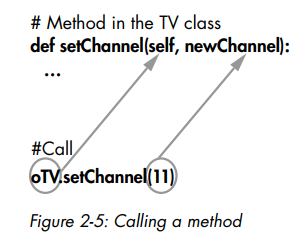

Sure! Here’s the raw Markdown text you can copy-paste directly into your `README.md` file:

````markdown
# 🐍 Python-OOP

A reference and learning resource for Python’s Object-Oriented Programming concepts.

---

## 📞 Method Calling in Python

To call a method on an object in Python, use the syntax:

```python
<object>.<method>(<any arguments>)
```
````

You might wonder why in class methods we **don't explicitly pass `self`**. Instead, we only provide the other arguments.

This is because **Python implicitly passes the object itself as the first argument** (which corresponds to `self`). So when you write:

```python
object.method(arg1, arg2)
```

Python translates it under the hood to:

```python
Class.method(object, arg1, arg2)
```

📌 This is why the method definition includes `self` as the first parameter.



---

## 🔁 Multiple Instances

You can create multiple instances of a class like so:

```python
oTV1 = TV()
oTV2 = TV()
```

Each instance maintains its own independent state.

---

## 🧱 Classes vs Objects

- **Class**: A blueprint defining the shape and capabilities of an object.
- **Object**: An instance created from a class, with its own data (instance variables) and access to class methods.

### Object Creation

```python
oDimmer1 = DimmerSwitch('Dimmer1')
```

### Object Metadata

```python
print(type(oDimmer1))  # <class '__main__.DimmerSwitch'>
print(oDimmer1)        # <__main__.DimmerSwitch object at 0x...>
```

- Line 1 shows the object’s class.
- Line 2 shows the object instance stored in memory.

---

## 🧠 Understanding `self`

### Mental Model 1:

Each object is a **self-contained unit** containing:

- Its own set of instance variables
- Access to methods from the class

### Mental Model 2:

When you call a method like:

```python
oDimmer1.toggle()
```

Python translates this as:

```python
DimmerSwitch.toggle(oDimmer1)
```

Hence, `self` refers to `oDimmer1` in this context.

---

## 🧭 Object Manager

An **Object Manager** is:

> An object that maintains a list or dictionary of other objects (often of the same class) and manages them by calling their methods.

---

## 🧩 Composition

**Composition** is a design principle where one object **contains or manages** one or more other objects to build complex behavior.

---

## ⚠️ Error Handling in Python

### Try-Except Pattern

```python
try:
    # code that might raise an exception
except SomeError:
    # handle the error
```

### Common Exceptions

| Error Type          | Cause                                                                            |
| ------------------- | -------------------------------------------------------------------------------- |
| `TypeError`         | Using incompatible data types<br>e.g. `"5" + 2`                                  |
| `ValueError`        | Passing correct data type but with an inappropriate value<br>e.g. `int("hello")` |
| `NameError`         | Using an undefined variable or function                                          |
| `ZeroDivisionError` | Dividing a number by zero                                                        |

---

## How to create your own Exceptions

```python
class <CustomExceptionName>(Exception):
    pass
```

Feel free to contribute improvements, add examples, or submit issues!
🛠️ Happy coding!
